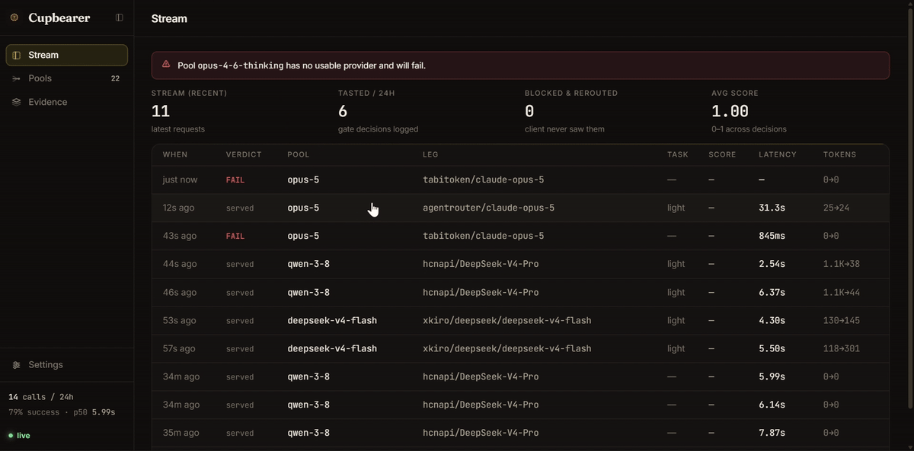

# Cupbearer

[](#)

> **The LLM gateway that never hands your task to a model that can't handle it.**

One OpenAI-compatible endpoint in front of all the free-tier and paid LLM keys you already own. Key pooling, rotation, and automatic failover — plus the part nobody else does: **quality-verified routing**. A request is only served from (or downgraded to) a cheaper model when quality measurably holds, and every decision is logged as evidence you can read.

MIT licensed. BYOK always: your keys stay on your machine, nothing phones home.

[](LICENSE) []() []()



---

## 30-second quickstart

```bash
npm install -g cupbearer     # or: npx cupbearer setup
cupbearer setup              # pick providers, paste keys, get a starter pool
cupbearer serve              # gateway on http://127.0.0.1:4143
```

```bash
curl http://127.0.0.1:4143/v1/chat/completions \
  -H "content-type: application/json" \
  -d '{"model":"smart","messages":[{"role":"user","content":"hello"}]}'
```

That's it. Any OpenAI-speaking tool now works against `http://127.0.0.1:4143/v1`, with your pooled keys, failover, and the quality gate behind it.

## Connect the agents you already use

**Cursor** — Settings → Models → OpenAI API key → check "Override OpenAI Base URL":

```text
Base URL:  http://127.0.0.1:4143/v1
API key:   anything   (loopback; the gateway holds the real keys)
Model:     smart      (your pool id from setup)
```

**Claude Code** — Cupbearer speaks the Anthropic Messages API too (`/v1/messages`), so the agent drops in with two environment variables:

```bash
export ANTHROPIC_BASE_URL=http://127.0.0.1:4143
export ANTHROPIC_AUTH_TOKEN=local   # any value; the gateway is loopback-only
claude                              # model names fall back to your first pool
```

**Anything else that speaks OpenAI** (opencode, Aider, Zed, your own code):

```python
from openai import OpenAI
client = OpenAI(base_url="http://127.0.0.1:4143/v1", api_key="local")
client.chat.completions.create(model="smart", messages=[{"role": "user", "content": "hi"}])
```

## What "quality-verified routing" means

Every gateway can fail over when a provider returns a 500. Cupbearer also refuses to hand your task to a model that *answers but can't do the job*:

1. **Profile** — each request is profiled heuristically ($0, no added latency): tools, images, size, generation budget → a required quality tier (flagship / standard / light) plus hard capabilities (tools, vision, long-context).
2. **Route** — the pool's cheapest sufficient leg serves first; lighter legs back it up.
3. **Verify** — when a leg is weaker than the request requires, its response is evaluated **before** the client sees a byte: $0 heuristic checks (JSON validity, empty/refusal, looping output, truncation, tool-arg sanity), optionally an LLM-as-judge on your own keys.
4. **Reroute or record** — failing the bar is just another pre-commit failover to a stronger leg. Every decision — score, evaluators, what happened — is stored in SQLite and reportable.

Two modes: `shadow` (log evidence, never block — the default) and `gate` (block failing downgrades). The dashboard's Quality view shows the live feed.

### A concrete request, end to end

Say your pool is `smart` with two legs — `groq/llama-3.3-70b` first, `gemini/gemini-flash-latest` second — and the gate is on:

1. Your client sends **"translate this sentence"**. The profiler marks it *light*. Groq answers; nothing is checked (nothing needed to be) — served in 400 ms.
2. Your client sends an **agentic coding task** (5 tools, big output). The profiler marks it *flagship*. Groq still serves first — but this time its answer is a downgrade, so Cupbearer holds it, runs the checks, finds the tool-call arguments are broken JSON, **blocks it**, and Gemini's answer goes to your client instead. Groq's junk is in the log, never in your editor.
3. Open **Evidence**: both requests are on the record with scores. That's the whole loop — you keep cheap keys first, and the strong model only pays for tokens when the cheap one actually can't do the job.

What it is **not**: a model beauty contest. Cupbearer never scores all your models and picks the smartest — your pool order is the intent. Its one opinion is veto power: a downgrade that fails the taste test never reaches you.

```
request → profile → tiered route → adapter (key pool, rotation) → quality gate → respond
                                       │ failover on any pre-commit failure ◄──┘
                                       ▼
                              SQLite decision log → dashboard / benchmark report
```

## The benchmark report

One command, honest numbers:

```bash
cupbearer benchmark --pool smart --reps 5
```

Fixed workload (structured JSON, exact format, condensation, code, extraction, agentic tool use), deterministic checks, every failure reported. Sample from a dry run — see [docs/benchmark-example.md](docs/benchmark-example.md):

| Metric | Value |
|---|---|
| Task pass rate | 100.0% (12/12) |
| Cost | **$0.00 spent** (free-tier keys) |
| Quality gate | 10 downgrade attempts evaluated — 6 held, **4 blocked & rerouted** |

Regenerate against your own pool for real numbers before posting anything anywhere.

## What it does / what it doesn't

**Does:**
- Pool free-tier + paid providers behind one OpenAI-compatible endpoint (and an Anthropic-compatible one)
- Rotate keys per provider with real health tracking: rate-limit cooldowns, quota exhaustion, dead-key detection, background revival
- Fail over mid-pool on any pre-commit failure — including quality-gated downgrades
- Work offline, self-hosted, zero telemetry, zero cloud dependencies, zero native modules
- Windows / macOS / Linux (loopback-bound by default; it holds your keys)

**Doesn't:**
- Share, resell, or pool keys across users — BYOK only, and you respect your providers' terms
- Run as a multi-tenant cloud service (single-user/team local gateway by design)
- Give you a hosted dashboard or billing — everything is local, including the evidence log
- Guarantee a model won't misbehave — the gate catches mechanical failure modes; use `gate` mode plus a judge for stricter guarantees, and read the evidence

## Providers

Built-in presets: Groq · Google Gemini (AI Studio API) · Cerebras · Mistral · NVIDIA NIM · OpenRouter · any custom OpenAI-compatible endpoint (Ollama, vLLM, LM Studio, …). Model lists are refreshed live from each provider after setup. Per-provider request quirks (schema sanitizers, thought-signature handling, stream repair) are a core subsystem — see [docs/quirks.md](docs/quirks.md).

## How it's built

One Node process, zero runtime dependencies (storage is `node:sqlite`, built into Node ≥ 22). Plain HTTP, real streaming, an in-process React dashboard, and 238 tests that run with `npm test` on any machine — no API keys required (the smoke test uses bundled stub providers).

| Path | What |
|---|---|
| `server/` | gateway: router, relay, health, quality gate, presets, SQLite store |
| `scripts/cli.js` | `setup` / `serve` / `doctor` |
| `scripts/benchmark.js` | the report generator |
| `ui/` | dashboard source (`npm run build`) |
| `docs/` | architecture, API, operations, extending, quirks |

## Docs

- [Architecture](docs/architecture.md) — process model, request lifecycle, failover contract
- [API](docs/api.md) — `/v1/*`, `/api/*`, SSE events
- [Operations](docs/operations.md) — settings reference, troubleshooting, backup
- [Extending](docs/extending.md) — add providers, pools, evaluators
- [Quirks](docs/quirks.md) — normalizing broken OpenAI-compatible upstreams

## Status & roadmap

v0.1 — the full gateway, gate, dashboard, and benchmark are in. Next: more presets and community quirks, LLM-assisted request profiling, multimodal passthrough endpoints, Anthropic surface tool-streaming. See [CHANGELOG.md](CHANGELOG.md) for history.

## License

[MIT](LICENSE) — © 2026 Cupbearer contributors
